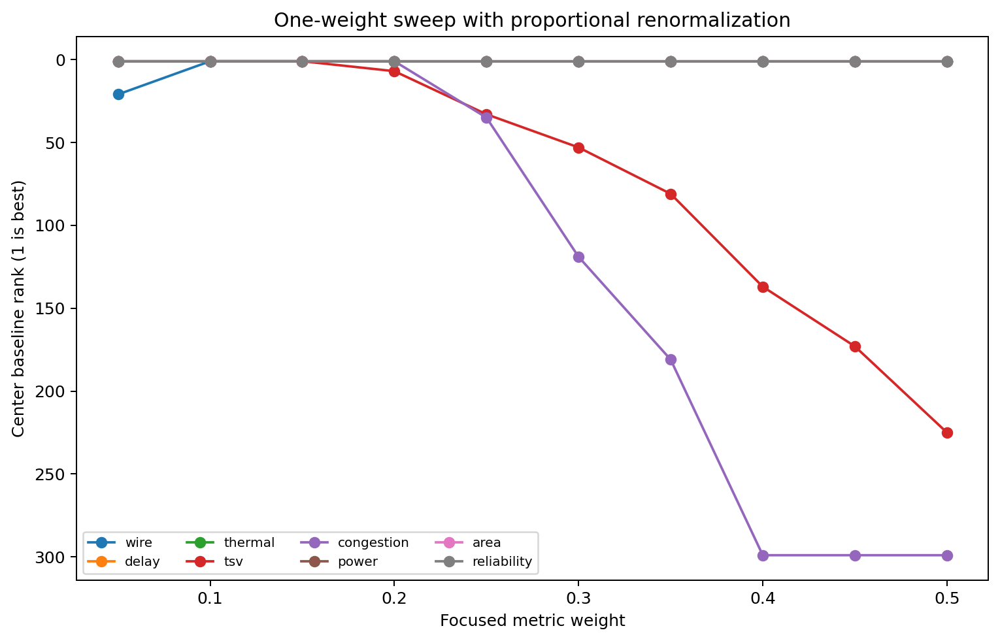
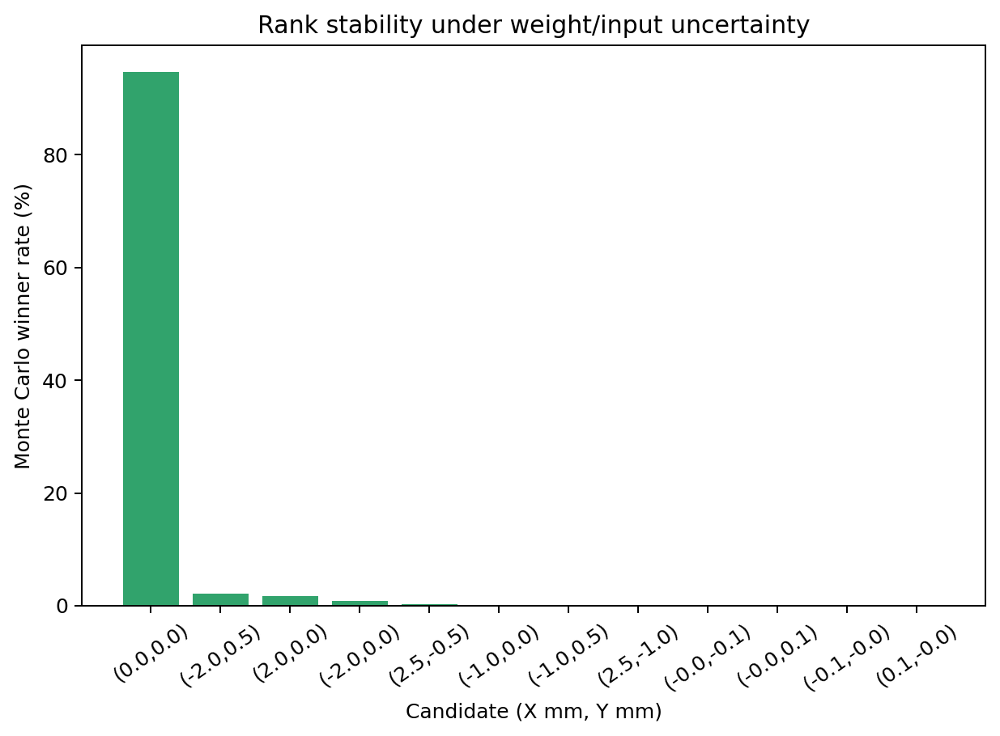
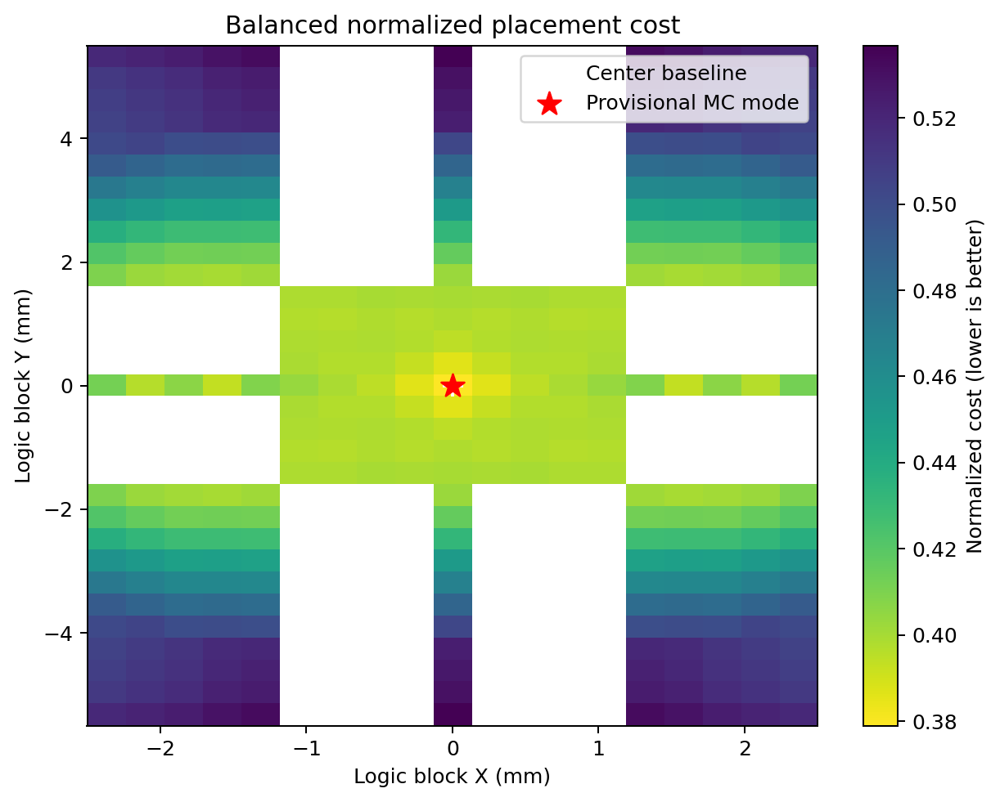
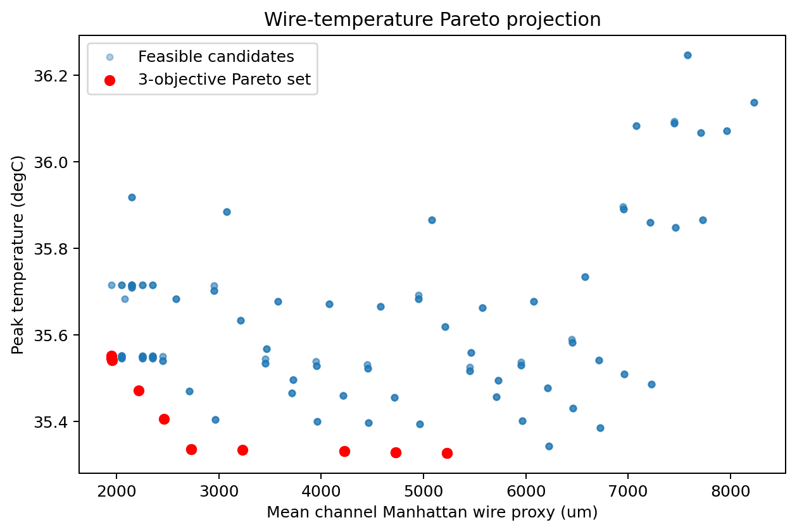
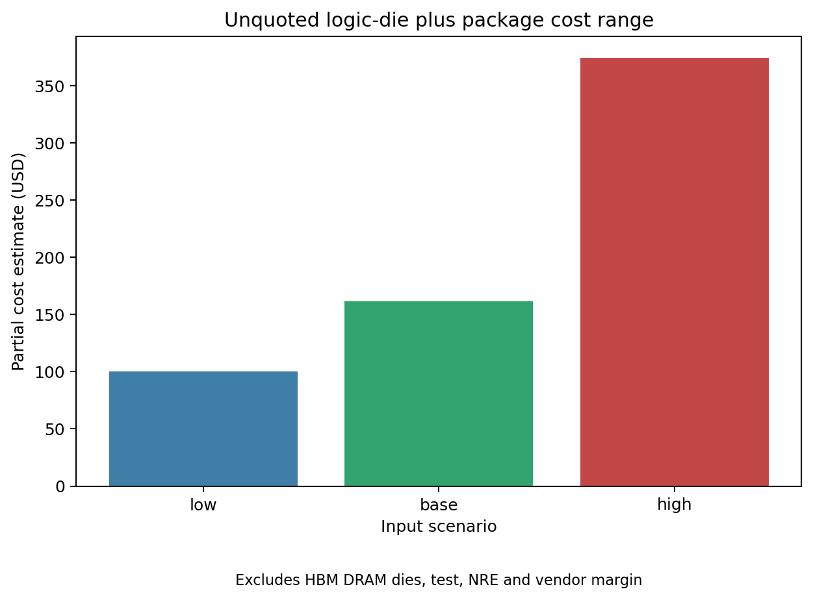

# GR00T HBM2 배치 불확실성·비용 분석 v2

작성일: 2026-08-06  
실험 단계: RTL 안정화 이전  
최종 추천: **보류**  
분석 상태: `withheld_pending_rtl_and_model_calibration`

## 1. 목적과 연구 질문

이 실험은 `report_96`의 사전 배치 모델에서 빠졌던 입력과 판정 조건을 보강한다.

1. 최고 온도만이 아니라 평균 온도, thermal gradient, 제한 초과량을 함께 보존하면 순위가 어떻게 변하는가?
2. TSV 연결 거리, 연결 수, keep-out 면적과 위반 penalty를 분리하면 중앙과 TSV 인접 후보의 trade-off가 어떻게 변하는가?
3. 가중치 sweep과 Monte Carlo에서 한 후보가 robust optimum 조건을 만족하는가?
4. 실제 제조 견적 없이 logic die와 package 비용 범위를 어디까지 계산할 수 있는가?

가설은 “현재 입력 불확실성과 닫히지 않은 timing 때문에 어떤 후보도 최종 추천 gate를 통과하지 못한다”이다.

## 2. 변경 이력과 실패 사례

`report_96`의 첫 고정 정규화 모델은 TSV 항목을 최근접 거리 하나로만 계산했다. v2에서는 다음을 추가했다.

- thermal: `Tmax`, `Tmean`, maximum gradient, temperature-limit exceedance.
- TSV: 최근접 거리, 1,024 signal connections, 대표 keep-out 면적, 위반 penalty.
- hard constraint: 후보별 온도·지연 제한과 전체 OpenROAD timing closure를 분리.
- uncertainty: 8개 비용 항목 각각 0.05~0.50 weight sweep, Monte Carlo top-5 rate와 95% Wilson interval.
- cost: wafer, defect density, assembly yield를 이용한 부분 비용 low/base/high.
- workload: normalization profile의 최소 input+output traffic.

이 변경으로 coarse winner 주변 fine-grid가 달라져 후보 합집합은 413개에서 333개로 변했다. 또한 TSV 비용의
상수·거리 성분 비중이 분리되면서 balanced winner가 `(-0.9,-0.1) mm`에서 중앙 `(0,0) mm`로 바뀌었다.
따라서 `report_96`의 0.41% 개선 결과는 변경 이력으로만 보존하며 최신 의사결정에는 사용하지 않는다.

또 하나의 실패는 후보의 compact-model 지연이 10 ns 이내라는 이유로 `hard_constraints_satisfied=true`를
기록했던 것이다. 실제 OpenROAD global-route slack은 `-35.650 ns`이므로 전체 구현 timing gate는 실패다
[L3]. v2에서는 모든 후보에 `global_rtl_timing_not_closed`를 기록한다.

v2 검증 과정에서도 첫 실행은 MET4 RC를 signal-delay proxy에 사용했다. authoritative
`setRC.tcl`을 다시 확인한 결과 `set_wire_rc -signal -layer met1`이므로 MET1의
`R=0.00120565 kohm/um`, `C=0.000172375 pF/um`로 수정했다 [L5]. 아래 결과는 이 수정 후 결과다.

## 3. 대상 모델과 대표성

대상은 NVIDIA `nvidia/GR00T-N1.7-3B`이다. checkpoint config revision은
`2fc962b973bccdd5d8ce4f67cc63b264d6886495`, Isaac-GR00T 소스 revision은
`b9955401d50c92a29258732e3ad6ccd579f1bdc0`이다 [S1-S3]. 공식 dtype은 BF16이나 로컬
microbenchmark는 FP16이다.

로컬 workload는 7개 LayerNorm/RMSNorm 형상을 합성 입력으로 한 번씩 측정하고 실제 코드에서 센 호출 수
333회로 투영한다 [L1]. 최소 input+output traffic은 다음 식으로 계산했다.

`sum(profile_calls * tensor_elements * 2 bytes * (one read + one write)) = 232,939,520 bytes`

100 MHz와 2,040,382 cycle을 그대로 결합하면 20.40382 ms, 최소 aggregate bandwidth는 11.416 GB/s다.
이는 affine parameter, reduction, intermediate, cache miss, protocol traffic을 제외한 **하한 추정**이다.
전체 GR00T inference, pretrained activation replay, 채널 요청률 또는 PCU utilization 측정 결과가 아니다.
기계 판독 결과는 `results/gr00t_workload_summary.json`에 있다.

## 4. 입력 가정 완전성

모든 입력의 low/base/high, 단위, 상태, 분포는 `gr00t_placement/assumptions.json`에 기록했다.

| 입력군 | 기준값 예 | 범위 | 판정 |
|---|---:|---:|---|
| normalization cycle | 2,040,382 cycle | fixed | 로컬 측정 투영 [L1] |
| 최소 read+write | 232.94 MB | ±20% | shape 기반 하한 [L1, A4] |
| tensor-call 요청률 | 2,500 calls/s/channel | 500~10,000 | C++ scheduler sweep 입력 [A4] |
| 채널 bandwidth | 128 GB/s/channel | 32~256 | 탐색 가정, 제품 rating 아님 [A4] |
| PCU utilization | 0.60 | 0.20~0.95 | 측정 필요 [A4] |
| logic active/leakage | 0.10/0.01 W | 0.05~0.20 / 0.003~0.03 | 전력 분석 필요 [A2] |
| HBM stack power | 8 W | 4~12 | 시나리오 [A2] |
| TSV diameter/pitch | 28/80 um | 10~40 / 40~120 | 대표 형상 [A1] |
| microbump diameter/pitch | 22/50 um | 10~35 / 30~100 | 대표 형상 [A1] |
| TIM conductivity/thickness | 4 W/mK / 0.05 mm | 1~8 / 0.02~0.10 | 재료 선택 필요 [A5] |
| interposer conductivity/thickness | 130 W/mK / 0.10 mm | 100~150 / 0.05~0.20 | 대표 Si 가정 [A5] |
| lid conductivity/thickness | 200 W/mK / 1.0 mm | 120~400 / 0.5~2.0 | 재료 선택 필요 [A5] |
| reserved PHY/PG/CTS area | 12/8/3% | 8~20 / 5~15 / 1~8% | P&R 측정 필요 [A1] |
| wafer/package cost | $10,000/$120 | $5k~20k / $50~300 | 견적 아닌 placeholder [A6] |
| defect density | 0.20/cm² | 0.05~0.50 | foundry 자료 필요 [A6] |

배선 RC는 local SKY130HD `setRC.tcl`의 LI1/MET1~MET5와 via 값을 모두 보존하며, placement delay
proxy에는 `set_wire_rc -signal -layer met1`에 맞춰 MET1 RC를 사용한다 [L5]. 축소 RTL
면적·배선·IR drop은 기존 OpenROAD 결과 [L2-L4]다.
현재 thermal solver는 steady-state만 계산하며 transient capacitance는 입력으로 보존했지만 사용하지 않는다.

## 5. 비용 함수 v2

총 비용 구조는 이전과 같은 8항목 가중합이다.

`C(p) = sum_i w_i * C_i_norm(p)`

각 정규화 값은 후보별 min-max가 아닌 고정 engineering reference로 나누고 `[0,1]`로 clip한다.
원래 단위값과 normalized 값은 `candidate_metrics.csv`의 `raw_*`, `norm_*` 열에 함께 남는다.

### 5.1 Thermal cost

`Cthermal_raw = (Tmax-Ta) + 0.25*(Tmean-Ta) + 0.20*gradient + 4*max(0,Tmax-Tlimit)`

`Tmax`, `Tmean`, gradient(°C/mm), exceedance(°C)는 별도 CSV 열로도 보존한다. 이 식의 계수는 보정되지
않은 설계 가정이다 [A3]. compact RC의 사용 목적과 한계는 HotSpot 및 3D-ICE 방법론과 비교했다 [S5,S6].

### 5.2 TSV cost

`Ctsv_raw = 0.55*distance/Rdistance + 0.15*count/Rcount + 0.15*KOZarea/Rarea + 0.15*violation/Rviolation`

현재 모든 후보는 keep-out 위반 시 탐색 전에 제외되므로 violation은 0이다. 1,024는 HBM2의 8 channels x
128-bit signal connectivity를 나타내는 proxy이며 [S4], 실제 TSV 총수나 제조사 pin map이라고 주장하지
않는다. 대표 시각화에는 128개 TSV 형상만 있으므로 signal connection 수와 그려진 TSV 수 역시 구분한다.

### 5.3 Delay와 hard constraints

배치는 Manhattan distance와 Elmore RC proxy를 사용한다. 이는 OpenROAD의 실제 routed wirelength와
구분된다. delay cost에는 longest path proxy와 채널 간 거리 skew가 들어간다. 후보별 thermal/delay
위반은 별도 infeasible 사유가 되며, 전체 OpenROAD negative slack은 모든 후보의 signoff gate를 막는다.

## 6. 가중치 sweep

Balanced의 한 항목을 0.05부터 0.50까지 0.05 간격으로 바꾸고 나머지 7개 가중치를 기존 비율대로 다시
정규화했다. 8 x 10 = 80 cases다.

- area, delay, power, reliability, thermal sweep에서는 중앙이 전 범위 winner였다.
- wire가 0.05이면 `(2.5,-1.0)`, 0.10 이상이면 중앙이었다.
- TSV weight가 0.20 이상이면 `(2.0,0)` 또는 `(2.5,-0.5)`로 이동했다.
- congestion weight가 0.25 이상이면 중앙에서 멀어져 혼잡 proxy가 배치 결과를 지배했다.



그림 1. 한 항목의 weight만 sweep했을 때 중앙 baseline 순위. 데이터: `results/weight_sweep.csv`.

## 7. Monte Carlo와 robust optimum

Balanced weight를 중심으로 Dirichlet sampling하고 thermal/power/area scale을 triangular sampling하여
seed `1701`로 1,000회 반복했다.

| 후보 (mm) | winner rate | 95% Wilson interval | mean rank | top-5 rate |
|---|---:|---:|---:|---:|
| (0,0) | 94.7% | 93.13~95.93% | **1.678** | **97.2%** |
| (-2.0,0.5) | 2.2% | 1.46~3.31% | 76.578 | 6.6% |
| (2.0,0) | 1.7% | 1.06~2.71% | 47.112 | 6.5% |
| (-2.0,0) | 0.8% | 0.41~1.57% | 47.674 | 6.5% |
| (2.5,-0.5) | 0.3% | 0.10~0.88% | 97.541 | 1.2% |

MET1 RC를 적용하면 중앙은 winner mode이면서 평균 순위도 가장 좋다. 사전에 정한 robust gate는 top-5
rate 80% 이상, 중앙 대비 balanced cost 1% 이상 개선, hard constraints 통과다. 중앙은 안정성 97.2%만
통과하고 개선 0%, global timing 실패이므로 전체 gate는 통과하지 못한다.



그림 2. 입력·가중치 불확실성에서 후보별 winner rate. 데이터: `results/monte_carlo_rank_stability.csv`.

## 8. 배치 및 Pareto 결과

333개 중 293개가 후보 수준 온도·배선 제한을 만족했다. 나머지 40개는 MET1 Elmore delay proxy가
10 ns를 초과했다. global timing gate까지 포함해 signoff hard constraints를 만족한 후보는 0개다.
wire-temperature-area 3목적 Pareto set은 15개다.



그림 3. balanced fixed-reference 비용. 흰 영역은 탐색하지 않았거나 PHY/TSV/die 제약으로 제외된 위치다.
데이터: `results/candidate_metrics.csv`.



그림 4. 3목적 Pareto set의 2D 투영. 온도는 보정되지 않은 steady-state 값이다.
데이터: `results/pareto_candidates.csv`.

## 9. 부분 제조비 추정

Agnesina et al.은 3D memory-on-logic PPAC 비용에서 foundry 변수와 implementation-dependent 변수를
분리한 parameterized model을 사용한다 [S10]. 여기서는 vendor quote가 없으므로 단순한 gross-die 기하,
Poisson yield proxy, wafer/package/assembly 입력만 사용한다.

| 시나리오 | base die area | logic die yield | logic die cost | logic+package 부분비용 |
|---|---:|---:|---:|---:|
| low | 77.76 mm² | 96.19% | $6.24 | $100.42 |
| base | 96.00 mm² | 82.53% | $18.13 | $161.56 |
| high | 116.16 mm² | 55.95% | $65.39 | $374.72 |



그림 5. 견적이 아닌 placeholder 입력 기반 범위. **HBM DRAM dies, test, NRE, vendor margin을 제외**한다.
원시 데이터: `results/manufacturing_cost_scenarios.csv`.

이 결과는 “실제 HBM 제품 가격”이 아니다. 직접 칩을 만들지 않아도 상대 민감도와 범위 추정은 가능하지만,
정확한 원가는 foundry 수율, mask/NRE, KGD, stack assembly, test 및 공급 계약 자료가 있어야 한다.

## 10. 용어 설명

- **HBM2**: 여러 DRAM die를 수직 적층하고 넓은 채널로 base logic die와 연결하는 고대역폭 메모리 규격이다.
- **Base logic die**: DRAM stack 아래에서 채널 인터페이스, 테스트·수리 또는 추가 로직을 담당하는 die다.
- **DRAM die**: memory cell array와 주변회로를 포함해 실제 데이터를 저장하는 적층 실리콘이다.
- **TSV**: Through-Silicon Via. silicon을 관통해 적층 die 사이를 수직 연결하는 도체다.
- **Microbump**: 인접 die 사이를 연결하는 미세 금속 범프다.
- **Keep-out zone**: TSV 응력·배선·공정 제약 때문에 cell 또는 배치를 제한하는 주변 영역이다.
- **Interposer**: logic/HBM/package 사이의 고밀도 배선을 제공하는 중간 기판이다.
- **PHY**: 신호 송수신, timing alignment와 training을 담당하는 physical interface 회로다.
- **HPWL**: Half-Perimeter Wirelength. net pin bounding box의 가로+세로 길이로 배선을 근사한다.
- **Routed wirelength**: 상세 배치·배선 도구가 실제 routing layer 경로를 따라 계산한 길이다.
- **Power density**: 단위 면적당 소비전력으로, hotspot 형성에 직접 영향을 준다.
- **Thermal resistance/capacitance**: 열 흐름에 대한 저항과 열 에너지 저장 능력이다.
- **Steady-state/transient temperature**: 시간이 충분히 지난 평형 온도와 시간에 따라 변하는 온도 응답이다.
- **Thermal gradient**: 공간에 따른 온도 변화율로, 큰 값은 국부 열응력과 인접 회로 온도차를 뜻한다.
- **Pareto front**: 어느 목적도 악화하지 않고 다른 목적을 개선할 수 없는 비지배 후보 집합이다.
- **Sensitivity analysis**: 입력 또는 weight 변화가 출력과 순위에 주는 영향을 평가하는 분석이다.
- **Uncertainty**: 입력을 정확히 알지 못해 결과가 범위나 확률분포를 갖는 상태다.
- **Robust optimum**: 합리적인 입력 변화에서도 높은 순위를 유지하고 제약을 만족하는 후보다.
- **Confidence interval**: 반복 표본으로 추정한 비율의 불확실 구간이다. 여기서는 winner rate에 Wilson 95%를 썼다.
- **Dynamic/leakage power**: switching에 비례하는 전력과 switching이 없어도 소모되는 정적 전력이다.
- **Congestion**: 제한된 routing 자원에 배선 수요가 집중된 정도다.
- **IR drop**: 전원망 저항 때문에 공급전압이 부하 위치에서 낮아지는 현상이다.
- **Timing slack**: 요구 도착시간과 실제 도착시간의 차이이며, 음수면 timing violation이다.

## 11. 재현 환경과 명령

환경 버전은 `results/environment.txt`, 실행시간과 commit SHA는 재실행 후 생성되는
`results/reproduction_manifest.json`에 저장한다.

```powershell
.\tools\reproduce_gr00t_placement_pre_rtl.ps1
```

개별 분석만 실행하려면 다음과 같다.

```powershell
python -m unittest discover -s experiment\gr00t_placement -p "test_*.py" -v
python experiment\gr00t_placement\analyze_placement.py
```

프롬프트 전문은 `gr00t_placement/experiment_prompts.md`, seed는 `1701`, 원시 로그는
`results/gr00t_normalization_reproduction.log`다.

## 12. 판정과 다음 실험 조건

가설은 채택된다. 현재 최종 후보는 없다.

- hard constraint: 실패. OpenROAD timing 미수렴.
- 중앙 대비 개선: 실패. v2 balanced winner 자체가 중앙이다.
- weight 우연성 배제: 실패. TSV/congestion sweep에서 위치가 크게 변한다.
- rank stability: 단독 통과. 중앙 top-5 rate 97.2%가 80% threshold를 넘지만 다른 gate는 실패한다.
- 실제 GDS 확인: 축소 로직 블록만 가능하며 전체 HBM 제조 구조는 대표 모델이다.

RTL 안정화 이후 필요한 입력은 다음과 같다.

1. 새 route와 timing-closed GDS, routed wirelength, congestion 및 IR drop.
2. GR00T trace를 주 저장소 `LogicDieScheduler`로 replay한 채널별 request count/rate, transfer bytes,
   queue delay, PCU busy/idle cycle 및 utilization.
3. VCD/SAIF 기반 dynamic power와 leakage power.
4. 제조사 PHY/TSV/microbump pin map과 reserved area.
5. TIM/interposer/lid stackup 및 보정된 steady-state/transient thermal 결과.
6. foundry/package vendor의 wafer, yield, KGD, assembly, test 및 NRE 범위.

## 13. 참고문헌과 출처-주장 대응표

| ID | 주장 | 출처 |
|---|---|---|
| S1-S3 | GR00T N1.7 소스·release·checkpoint | `gr00t_placement/sources.json`의 pinned NVIDIA/Hugging Face URL |
| S4 | HBM2E 8 channels, 128-bit/channel | Micron, *Integrating and Operating HBM2E Memory* |
| S5 | early-stage compact thermal RC | W. Huang et al., *IEEE TVLSI*, 2006, DOI 10.1109/TVLSI.2006.876103 |
| S6 | stacked 3D IC compact thermal modeling | A. Sridhar et al., *ICCAD*, 2010, 3D-ICE |
| S7 | TSV·온도·wirelength·area 공동 floorplanning | B. Jang et al., *ETRI Journal*, 2014, DOI 10.4218/etrij.14.0113.1204 |
| S8 | RTL-to-GDS flow | OpenROAD Flow Scripts commit `778c4e556a6f1d104621b92f6a851324bf34ff1a` |
| S9 | GR00T N1 model family | NVIDIA et al., arXiv:2503.14734, 2025 |
| S10 | parameterized 3D PPAC cost model | A. Agnesina et al., ISLPED 2021, DOI 10.1109/ISLPED52811.2021.9502475 |
| L1 | 7 profiles, 333 calls, FP16 cycles | local `Gr00tNormalizationTestCases.cpp`, commit `ecacdb9c1d3ae1f838dbfd2f7e80fbb73c4b217d` |
| L2-L5 | GDS route, timing, IR, SKY130 RC | pinned local OpenROAD/ORFS outputs |
| A1-A6 | 제품 자료가 없는 geometry·power·thermal·traffic·cost 값 | 명시적 가정, `assumptions.json` |

정확한 저자, 제목, URL, revision, 접근일과 각 source가 지지하는 claim은
`gr00t_placement/sources.json`이 authoritative source registry다.
