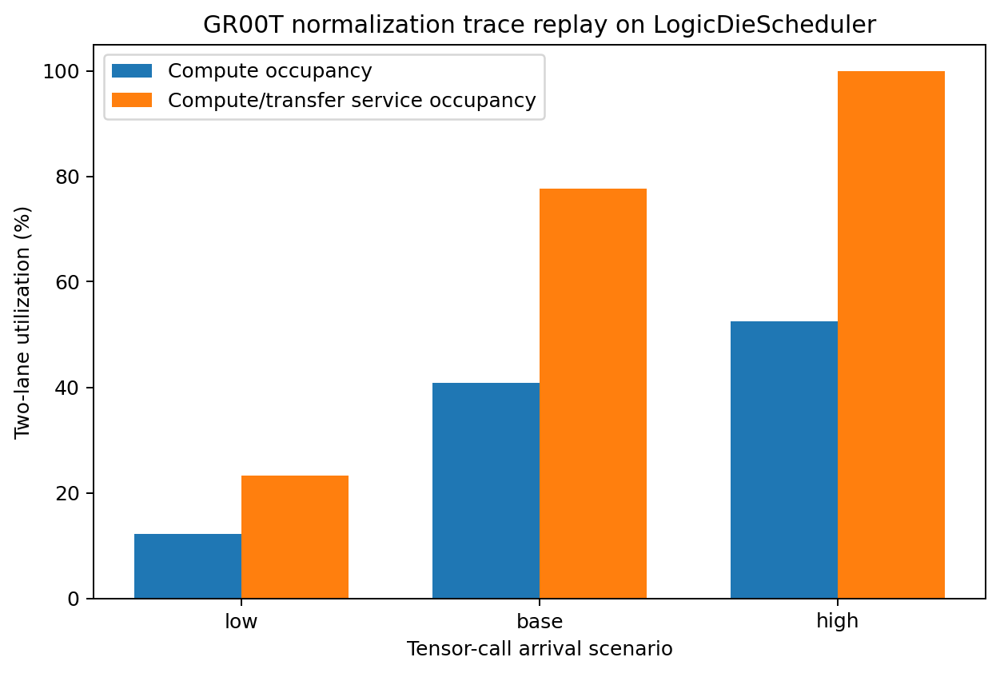

# GR00T normalization LogicDieScheduler trace replay

작성일: 2026-08-06  
단계: RTL 안정화 이전 C++ 자원 모델 실험  
최종 배치 추천: 보류

## 1. 목적과 가설

목적은 GR00T N1.7 normalization 대표 profile 333회를 8개 HBM channel에 분배하고, 주 저장소의 실제
`src/LogicDieScheduler.h` 자원 예약 모델에서 queue, compute/transfer service, channel traffic과 lane
utilization을 측정하는 것이다.

가설은 tensor-call 입력률이 scheduler 처리율을 넘으면 queue가 급증하고 `16 PCU + 64 B/cycle`의 두
service lane이 포화된다는 것이다.

## 2. 모델과 trace

대상 모델은 `nvidia/GR00T-N1.7-3B`, checkpoint revision
`2fc962b973bccdd5d8ce4f67cc63b264d6886495`다 [S1-S3]. 입력 profile은 local
`Gr00tNormalizationTestCases.cpp` commit `ecacdb9c1d3ae1f838dbfd2f7e80fbb73c4b217d`의
7개 LayerNorm/RMSNorm 형상과 호출 횟수다 [L1].

| profile | shape | calls | measured cycles/call |
|---|---:|---:|---:|
| vlln | 280 x 2048 | 1 | 17,198 |
| VL attention norm | 280 x 2048 | 8 | 17,198 |
| DiT AdaLN norm1 | 41 x 1536 | 128 | 4,856 |
| DiT norm3 | 41 x 1536 | 128 | 4,856 |
| DiT output norm | 41 x 1536 | 4 | 4,856 |
| Qwen input/post-attention | 280 x 2048 | 32 | 9,735 |
| Qwen Q/K RMSNorm | 8960 x 64 | 32 | 9,735 |

각 호출의 최소 traffic은 `rows * hidden * 2 bytes * (read+write)`다. 합계는 232,939,520 bytes다.
이는 affine parameter, intermediate, cache/protocol traffic을 제외한 하한이다.

호출은 ordinal 기준 round-robin으로 8개 channel에 배정한다. channel 0~4는 42 calls, channel 5~7은
41 calls다. channel 0의 byte가 조금 더 큰 것은 profile 순서와 round-robin 배정의 결과다. 실제 GR00T
runtime의 channel address mapping trace가 아니다.

## 3. Scheduler 설정

| 입력 | 값 | 상태 |
|---|---:|---|
| HBM channel | 8 | HBM2 channel 구성 [S4] |
| clock | 100 MHz | 기존 10 ns constraint [L3] |
| global PCU | 16 | simulator design point [A4] |
| blocks/request | 8 | trace mapping 가정 [A4] |
| scheduler parallel lanes | 2 | `PCU / blocks` |
| transfer bandwidth | 64 B/cycle | simulator design point [A4] |
| input rate low/base/high | 500 / 2,500 / 10,000 calls/s/channel | sweep 가정 [A4] |

`LogicDieScheduler::reserve()`는 요청마다 두 lane 중 먼저 비는 lane을 고른다. compute service는 local
normalization measured cycles, transfer service는 `ceil(bytes/64)`이며 한 요청의 service는 두 값의
최댓값이다. 따라서 compute와 transfer가 겹칠 수 있다는 기존 scheduler 모델을 그대로 사용한다.

## 4. 실패와 수정

첫 실험은 입력률을 5/25/100 million requests/s/channel로 두었다. 그러나 여기서 request는 작은 DRAM
transaction이 아니라 tensor 하나의 normalization 호출이므로 세 시나리오가 모두 즉시 포화됐다. 단위를
`tensor calls/s/channel`로 명확히 하고 500/2,500/10,000으로 수정해 비포화·경계·포화 구간을 만들었다.
첫 결과를 최종 수치로 사용하지 않는다.

## 5. 결과

| scenario | offered aggregate | completion span | mean queue | max queue | compute util. | service util. | achieved calls/s | bandwidth |
|---|---:|---:|---:|---:|---:|---:|---:|---:|
| low | 4,000/s | 8,335,840 cyc | 0 cyc | 0 cyc | 12.2% | 23.3% | 3,994.8 | 2.794 GB/s |
| base | 20,000/s | 2,496,880 cyc | 86,318 cyc | 801,040 cyc | 40.9% | 77.7% | 13,336.6 | 9.329 GB/s |
| high | 80,000/s | 1,942,194 cyc | 424,228 cyc | 1,491,354 cyc | 52.5% | 99.9% | 17,145.6 | 11.994 GB/s |

모든 scenario에서 총 compute는 2,040,382 lane-cycles, transfer는 3,639,680 lane-cycles, per-request
`max(compute,transfer)`의 합은 3,878,880 service lane-cycles다. queue total은 여러 요청의 대기시간을
합한 값이므로 wall-clock cycle과 직접 비교하지 않는다.



그림 1. 두 scheduler lane의 compute occupancy와 compute/transfer service occupancy. 원시 데이터:
`gr00t_placement/results/gr00t_scheduler_replay.csv`.

## 6. 해석

- low는 queue가 전혀 없어 offered 4,000 calls/s를 거의 그대로 처리한다.
- base는 도착률 20,000 calls/s가 이 trace의 처리율보다 높아 queue가 누적된다.
- high는 service utilization 99.9%로 포화하며 achieved 처리율은 약 17.1k calls/s에서 제한된다.
- compute utilization이 high에서도 52.5%인 이유는 일부 큰 tensor에서 64 B/cycle transfer가 compute보다
  길기 때문이다. PCU 수만 늘려도 transfer service가 그대로면 처리율이 선형 증가하지 않는다.
- 최소 traffic 기준 최대 achieved bandwidth가 약 12.0 GB/s이므로, 배치 모델의 채널 wire/delay뿐 아니라
  중앙 scheduler와 내부 link bandwidth가 성능 병목이 될 수 있다.

## 7. 용어

- **Trace replay**: 기록 또는 구성한 요청 순서를 자원 모델에 다시 입력해 queue와 완료시간을 측정하는 실험이다.
- **Offered rate**: scheduler에 요청이 도착하도록 설정한 입력률이다.
- **Achieved throughput**: 전체 trace 요청 수를 실제 completion span으로 나눈 처리율이다.
- **Queue cycle**: 도착 후 service lane을 얻기까지 기다린 cycle 수다.
- **Compute utilization**: 전체 compute lane-cycle을 `span * lane count`로 나눈 비율이다.
- **Service utilization**: compute/transfer overlap 모델의 실제 service lane-cycle 점유율이다.
- **Saturation**: 요청 도착률이 처리율 이상이어서 service 자원이 거의 항상 busy이고 queue가 계속 쌓이는 상태다.

## 8. 재현 절차

전체 실험:

```powershell
.\tools\reproduce_gr00t_placement_pre_rtl.ps1
```

C++ replay만 WSL에서 실행:

```bash
g++ -std=c++17 -O2 -Wall -Wextra -I. \
  experiment/gr00t_placement/gr00t_scheduler_replay.cpp \
  -o /tmp/stob_gr00t_scheduler_replay
/tmp/stob_gr00t_scheduler_replay \
  experiment/gr00t_placement/results/gr00t_scheduler_replay.csv
```

입력 prompt 전문은 `gr00t_placement/experiment_prompts.md`, commit과 실행시간은
`gr00t_placement/results/reproduction_manifest.json`에 있다. 분석 seed는 `1701`이며 C++ replay 자체는
난수를 사용하지 않는다.

원시 결과:

- scenario 요약: `results/gr00t_scheduler_replay.csv`
- base 요청 333행: `results/gr00t_scheduler_replay_base_trace.csv`
- 소스: `gr00t_scheduler_replay.cpp`
- console: `results/full_reproduction_console.log`

## 9. 한계와 다음 실험

- 전체 GR00T inference나 pretrained activation trace가 아니다.
- 실제 HBM address mapping, bank conflict, refresh, PHY protocol을 replay하지 않는다.
- normalization 한 호출을 scheduler 한 요청으로 매핑한 coarse-grain 모델이다.
- profile 순서가 실제 execution interleaving과 같다고 보장할 수 없다.
- `16 PCU`, blocks 8, 64 B/cycle은 확정 RTL 사양이 아니다.
- power/VCD/SAIF를 생성하지 않으므로 utilization을 watt로 직접 변환할 수 없다.

RTL 안정화 후 실제 command generator에서 channel/address/timestamp trace를 추출하고, PCU 8/16/32 및
32/64/128 B/cycle cross-sweep을 실행해야 한다. 이후 utilization을 SAIF 기반 power와 결합해 배치 열원으로
입력한다.

## 10. 참고문헌과 출처-주장 대응표

| ID | claim | source |
|---|---|---|
| S1-S3 | GR00T N1.7 identity/config | pinned NVIDIA GitHub, release, Hugging Face config in `sources.json` |
| S4 | 8 channels, 128-bit/channel | Micron, *Integrating and Operating HBM2E Memory* |
| L1 | profile shape, calls, measured cycles | local `Gr00tNormalizationTestCases.cpp`, commit `ecacdb9…` |
| L3 | 10 ns clock constraint | local OpenROAD global-route log |
| A4 | request mapping/rate and scheduler design points | explicit assumptions in `assumptions.json` |
| C1 | scheduler reservation behavior | `src/LogicDieScheduler.h`, main repo commit in reproduction manifest |

`C1`은 외부 출처가 아니라 이 저장소의 현재 구현이다. 정확한 외부 URL, revision, 접근일은
`gr00t_placement/sources.json`에 보존한다.
